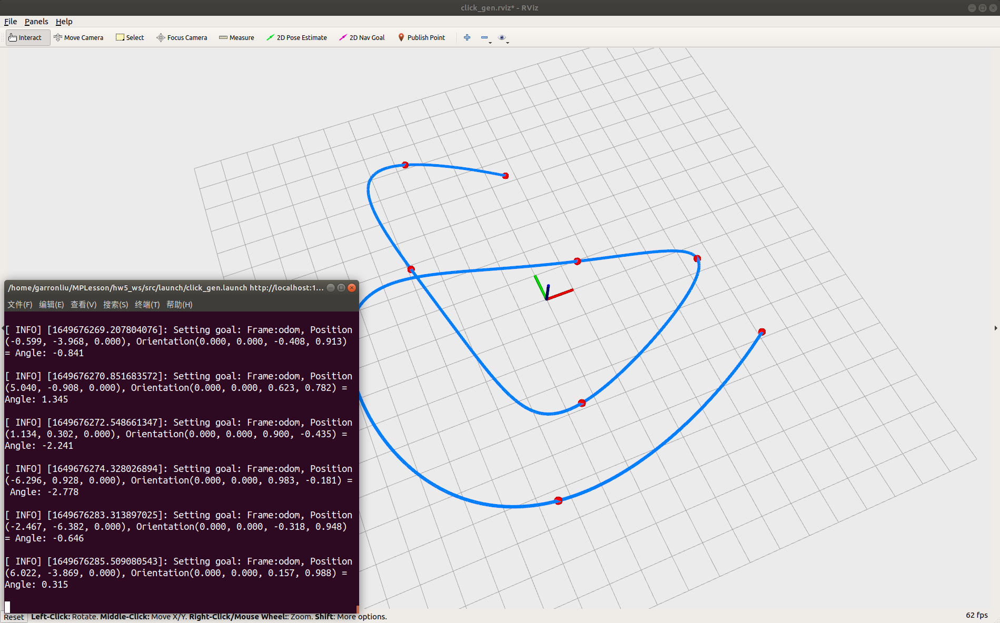
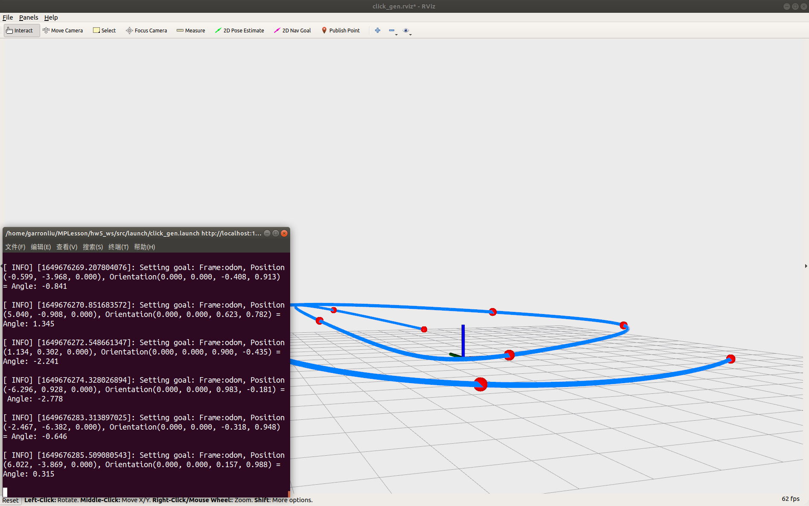
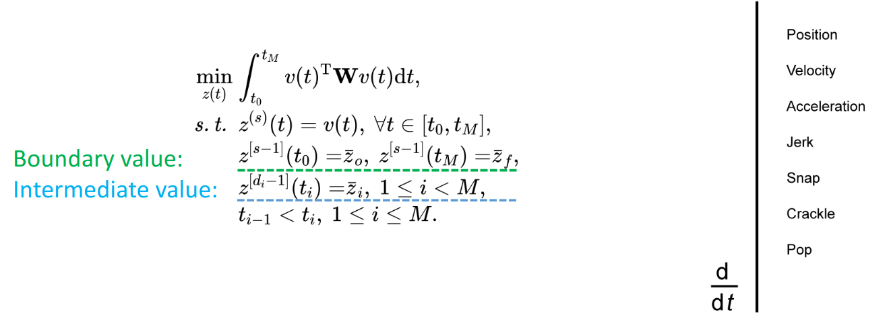
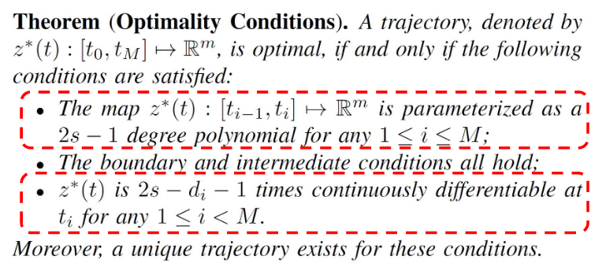
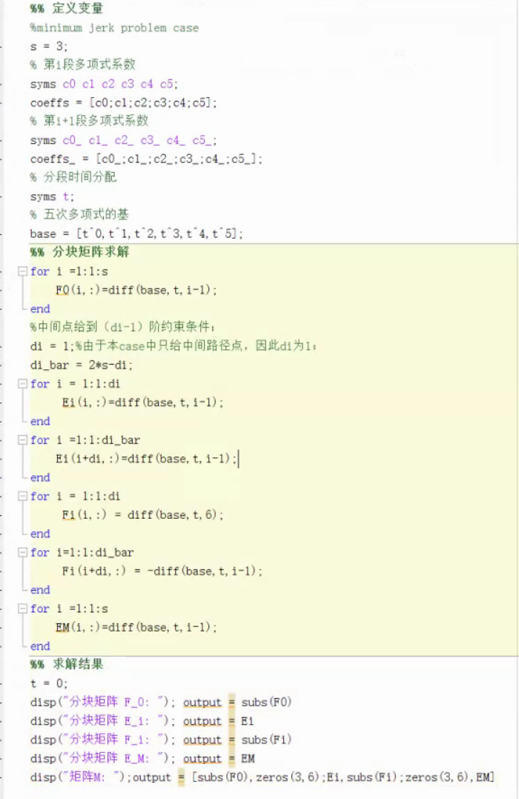

# Motion_Planning_Hw5

深蓝学院《移动机器人运动规划》第九期，第5章课程作业。该代码实现了基于BIVP（Boundary Intermediate Value Problem)，在给定一系列路径点以及首末端点的位置、速度和加速度信息的条件下，求解minimum jerk最优轨迹。

# Compile

使用以下指令下载和编译代码：
    
```
mkdir -p ~/MPLesson_ws/src
cd ~/MPLesson_ws/src
git clone https://github.com/GarronLiu/Motion_Planning_Hw5.git
cd ..
catkin_make
```

# Run the Package

```
cd ~/MPLesson_ws 
source devel/setup.bash
roslaunch lec5_hw click_gen.launch
```
点击2D Nav goal，输入一系列路径点，即可生成满足minimum jerk的五次多项式轨迹。

# Result

具体结果如下

<p align='center'>
    
    
</p>

可见生成的轨迹是三维的。这是因为各个维度是相互解耦的，所以只要给定Mc=b中的矩阵M以及右端项b，即可快速求解各个维度各个分段的五次多项式系数。

# Mathematic Model

<p align='center'>
    
</p>

- 上图给出了BIVP最优化问题的一般定义,首末两端的各阶次边界值全部给出，中间点只给出有限阶次的函数值，各分段多项式在连接点处更高阶函数值需满足连续性条件。当中间点给出所有阶函数值时便退化为BVP，因此BIVP更具一般性，更符合工程应用需求；本case中间点仅给出路径点信息，因此对应di=1。
- 当求解问题为minimum jerk problem时，亦即v(t)=jerk时，有s = 3；根据下图的最优条件定理可知，对应jerk能量最优的轨迹必定是五次多项式（2s-1=5)
<p align='center'>
    
</p>
- 因此以m个分段（对应m+1个路径点）各自的多项式系数为未知变量，根据边界值，中间点以及中间点处的连续性条件建立方程Mc=b进行求解，其中M为6m*6m方阵，c、b均为为6m*3的列向量。
- 易知M是带状矩阵，且具有非奇异性，因此求解时间仅与未知变量数成线性关系；可调用Eigen库中的LU分解进行求解。
- 
# 分块矩阵求解

- 基于Matlab的符号运算功能进行求解

<p align='center'>
    
</p>

